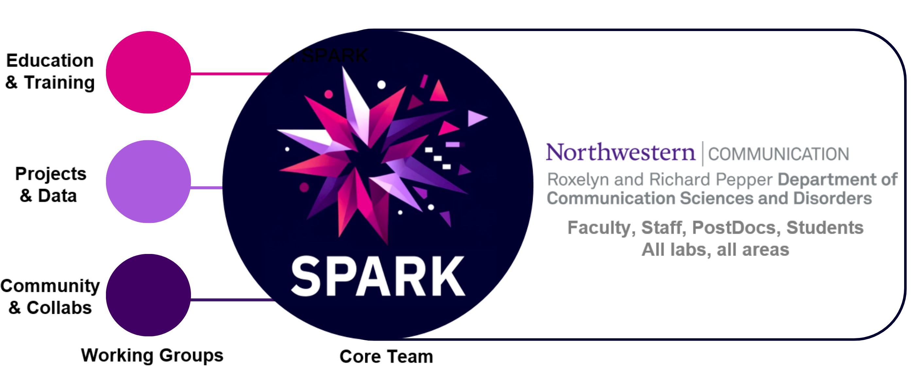

# Structure

{:.tail width="1920" height="1260" loading="lazy"}

As you can see above, there are two important aspects concerning SPARK's structure:

 
- it spans the entire department, all individuals (Faculty, Staff, PostDocs, Students), all labs and all areas (clinical, translational, applied, basic research)

- it consists of a Core Team (currently Peer Herholz, but new members will join soon) and Working Groups focusing on one of three aspects (the call for leads and co-leads will go out soon)

The rationale behind this structure is to build a department-wide, all-encompassing initiative and center/hub that is sustainable and provides a high level of agency for everyone interested.